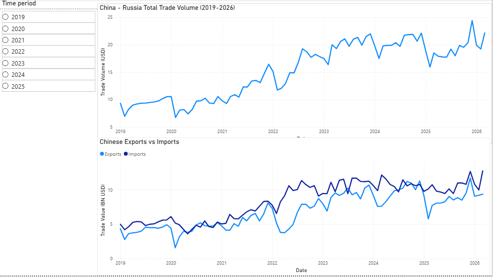

# China–Russia Trade Dynamics Dashboard (2019–2026)

## Overview
This project analyzes the evolution of China–Russia trade relations using time-series data on total trade volume, exports, and imports. The goal is to identify structural changes in trade flows and assess how geopolitical and economic factors have influenced bilateral economic relations.

## Data Sources
- MERICS China–Russia Trade Dataset
- Official trade statistics (harmonized CSV format)

## Tools Used
- Power BI
- Power Query (data cleaning and transformation)
- DAX (measures for exports and imports)
- Data visualization techniques for time-series analysis

## Key Features
- Interactive time-series dashboard
- Trade volume trends over time
- Export vs import comparison
- Year-based filtering for dynamic analysis

## Key Insights
- Clear structural shift in trade composition over time
- Increasing divergence between export and import dynamics
- Noticeable trend changes after 2022 reflecting geopolitical impact
- Long-term trade growth with short-term volatility patterns

## Project Purpose
This project was built to strengthen skills in data analysis, dashboard design, and geopolitical economic interpretation using real-world trade datasets.

## Preview

